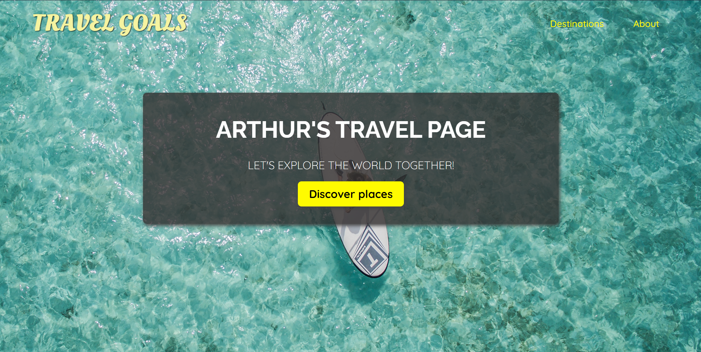

<h1 align="center">
  
</h1>
---

## 💻 Project
---

This repository was created to store the Travel Goals project, it has three pages well styled and well-structured, and the purpose of this project is to practice the HTML5 and CSS3 semantics and concepts.


## 🧰 Technologies
---

This project was developed with the following technologies:

- HTML
- CSS
- LiveServer


### 👀 Prerequisites
---

Before starting, you will need to have the following tools installed on your machine:<br/>
[Git](https://git-scm.com) to clone this repository<br/>
A code editor like [VSCode](https://code.visualstudio.com/) and, if you are using VSCode, you can use the [Live Server](https://marketplace.visualstudio.com/items?itemName=ritwickdey.LiveServer) extension to open the project.


### 👨‍💻 Running the Project
---

```bash
# Clone this repository
$ git clone https://github.com/Arthur-Ferreira/TravelGoals

# Access the project folder
$ cd TravelGoals

# If you're using the Live Server extension
# Right click in the "index.html" file and click in "Open With Live Server"
```


---
<p align="center">
Made with 🖤 by ARTHUR FERREIRA
</p>